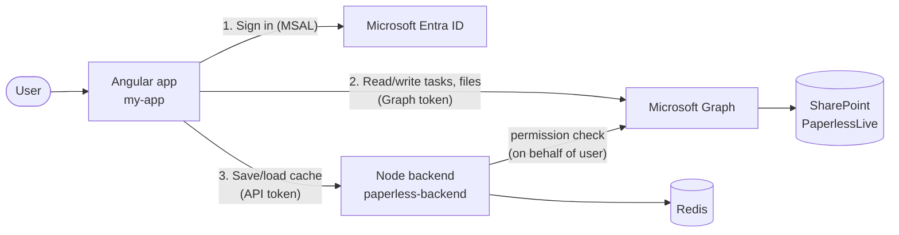
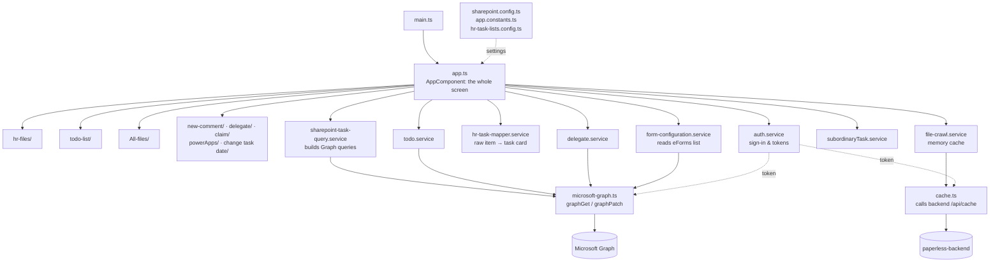
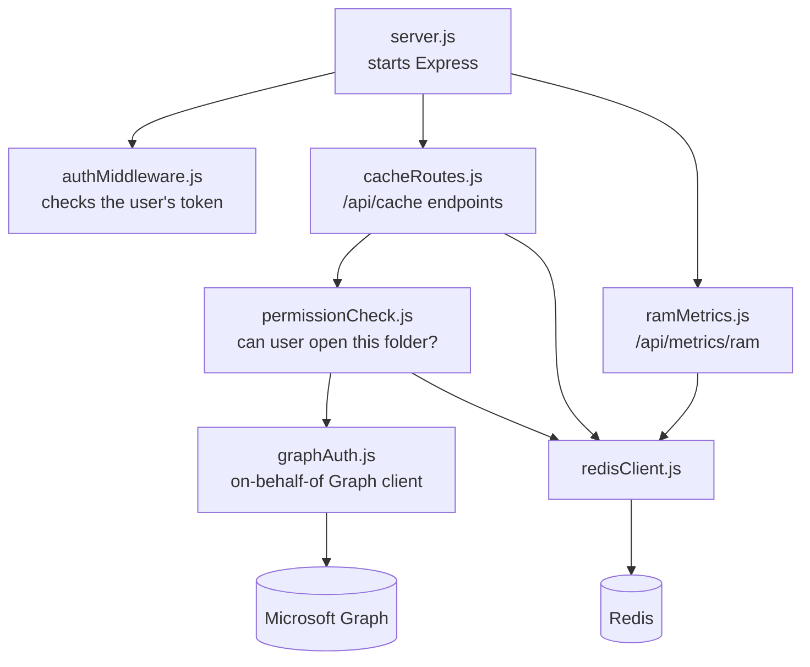
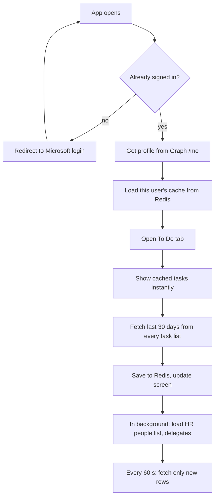
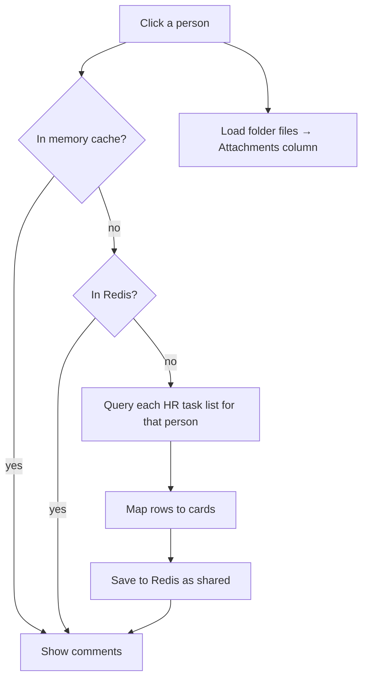

# Paperless

A web app for Enemalta staff to see their **HR tasks**, **eForm comments** and **files** from SharePoint in one place.

- **Frontend:** Angular (`my-app/`)
- **Backend:** Node + Express (`paperless-backend/`)
- **Cache:** Redis
- **Data:** SharePoint Online, read through Microsoft Graph

---

## 1. Quick start

You need three things running. Open three terminals.

```powershell
# 1. Redis (cache)
.\redis-windows\redis-server.exe --port 6379
```

```powershell
# 2. Backend  → http://localhost:3000
cd paperless-backend
npm install
npm run dev
```

```powershell
# 3. Frontend → http://localhost:4200
cd my-app
npm install
npm start
```

Check the backend at http://localhost:3000/api/health. It should return `{ "server": "ok", "redis": "PONG" }`.

---

## 2. How it works (big picture)



1. **Sign in.** The user signs in with their Microsoft account through MSAL.
2. **Load data.** Angular calls Microsoft Graph directly to read task lists, eForms and document libraries.
3. **Cache.** Everything Angular loads is saved to Redis through the backend. The next load or the next user then paints instantly.

### The screen

| Column | What it shows | Where |
|---|---|---|
| **Left** | Tabs: *HR Files* (people), *To Do* (my tasks), *All Files* (libraries) | `app.html`, `hr-files/`, `todo-list/`, `All-files/` |
| **Middle** | **Comments**: task cards for the selected person/folder | `app.html` + `app.ts` |
| **Right** | **Attachments**: files in the selected folder | `app.html` + `app.ts` |

On mobile the three columns become tabs (`mobile navigation/`).

---

## 3. Why a Node backend?

Angular could talk to Graph alone. The backend exists for three reasons:

1. **Shared cache.** The browser can't share data between users. Redis can. When one person opens an HR folder, the result is stored once and the next person gets it instantly.
2. **Safety.** The backend checks every user's token and asks Graph *as that user* (the "on-behalf-of" flow) before returning shared data. Nobody can read a cached folder they can't open in SharePoint.
3. **Secrets.** The client secret must never live in the browser. Only the backend holds it (in `.env`).

---

## 4. Redis

Redis is an in-memory key/value store. Here it stores cached SharePoint results so the app doesn't re-download them.

| Key in Redis | What it holds | Who can see it |
|---|---|---|
| `cache:<userId>:…` | Personal data (e.g. *My Tasks*) | Only that user |
| `shared:fc:files:folder:…` | Folder listings (All Files) | Anyone who can open that folder |
| `shared:fc:tasks:lib:v7:…` | Comments for a library folder | Anyone who can open that list |
| `shared:fc:tasks:hr-folder:…` | Comments for an HR person | Anyone who can open that person's folder |
| `perm:<userId>:…` | "Can this user open X?" (yes 15 min / no 5 min) | Internal |
| `tasks:<list>:<email>` | Old per-person task lookup | Internal |

- Entries expire after **7 days** (`CACHE_ENTRY_TTL_SECONDS`).
- **Local:** portable Windows build in `redis-windows/` (Docker is blocked on this machine).
- **Production:** use Azure Cache for Redis. Only `REDIS_URL` changes.
- **RAM check:** run `npm run ram-report` in `paperless-backend`, or call `GET /api/metrics/ram`.

---

## 5. The `.env` file

Lives in `paperless-backend/.env`. **Never commit it** (it's already in `.gitignore`).

| Key | What it is | Example |
|---|---|---|
| `TENANT_ID` | Enemalta's Microsoft tenant id | from `sharepoint.config.ts` |
| `CLIENT_ID` | The Azure app registration id | from `sharepoint.config.ts` |
| `CLIENT_SECRET` | Secret for that app (Azure → *Certificates & secrets*) | `abc~123…` |
| `REDIS_URL` | Where Redis is running | `redis://localhost:6379` |
| `SITE_PATH` | SharePoint site in Graph form | `emoffice365.sharepoint.com:/sites/PaperlessLive` |
| `TASKS_LIST` | Default list for `/api/tasks` | `HRTaskTelework` |
| `CACHE_TTL_SECONDS` | Expiry for `/api/tasks` cache | `300` |
| `PORT` | Backend port | `3000` |
| `CORS_ORIGINS` | Sites allowed to call the backend (comma-separated) | `http://localhost:4200` |
| `CACHE_ENTRY_TTL_SECONDS` | *(optional)* Cache expiry, default 7 days | `604800` |
| `HR_LIBRARY_NAME` | *(optional)* HR library name, default `HRPersonal` | `HRPersonal` |

**One-time Azure setup** (app registration → *Expose an API*): add the scope `access_as_user`. Angular asks for this scope to call the backend.

---

## 6. Folders

```
Paperless/
├── my-app/                 Angular frontend
│   ├── src/app/            All app code (see below)
│   ├── public/             Icons and images
│   ├── desktop/            Electron wrapper → Windows .exe
│   └── scripts/            Old HTML extracts (reference only)
├── paperless-backend/      Node + Express API, talks to Redis
├── redis-windows/          Portable Redis for local dev (not in git)
├── reusable login template/  Stand-alone MSAL sign-in template
├── .github/workflows/      Auto-deploy frontend to GitHub Pages on push to main
└── cleanup-component-naming.ps1   One-off script to tidy component folder names
```

---

## 7. How the files connect

### Frontend



### Backend



---

## 8. Where to find things

### Frontend: `my-app/src/app/`

**Root files**

| File | What it does |
|---|---|
| `app.ts` / `app.html` | The main screen. Holds all three columns and most of the logic. |
| `sharepoint.config.ts` | **Start here.** Tenant, site, backend URL, list names. |
| `app.constants.ts` | Tuning numbers: page sizes, timeouts, how many days of tasks to load. |
| `hr-task-lists.config.ts` | Names of the HR/procurement task lists to read. |
| `microsoft-graph.ts` | `graphGet`, `graphPost`, `graphPatch`, `graphGetWithRetry`: every Graph call goes through here. |
| `utils.ts` | Retry, delay, `Semaphore`, `runWithConcurrencyLimit`. |
| `file-utils.ts` | File icons, extensions, SharePoint URL fixes. |
| `form-utils.ts` | `formatFormTitle`: turns `SickLeave_Tasks` into "Sick Leave". |

**Key functions in `app.ts`**

| Area | Functions |
|---|---|
| Sign-in | `checkLoginOnStart`, `trySilentSignIn`, `loadCurrentUserProfile`, `logout` |
| To Do | `loadTodoTasksForCurrentUser`, `refreshTodoTasksIncrementally`, `loadMoreTodoTasks`, `reloadTodoTasksWithSubordinates` |
| HR Files | `loadHrFilesInFirstSection`, `openHrFileListItem`, `prefetchHrPersonComments`, `warmHrPersonalRootFoldersCache` |
| All Files | `onLibrarySelected`, `onAllFileSelected`, `loadAllFilesTasksForLibrary` |
| Attachments | `openFolder`, `goBackToParent`, `loadMyFilesFromDrive` |
| Refresh | `onManualRefresh` (button), `startSharePointCachePoll` (auto every 60 s) |
| Actions | `onDelegateTask`, `onCompleteTask`, `onNewCommentSaved`, `onTaskDueDateChanged` |

**Components: `components/`**

| Folder | What it is |
|---|---|
| `hr-files/` | People list in HR Files (search, sort, paging). |
| `todo-list/` | My Tasks list, plus the *Subordinate Tasks* manager view. |
| `todo-list/change task date/` | Date picker that saves a new due date to SharePoint. |
| `All-files/` | Library browser and search across files, comments and attachments. |
| `new-comment/` | "Add comment" popup. `complete/` is the Complete-task popup. |
| `delegate-component/` | Reassign a task to another user. |
| `Claimable Task/` | Claim a task from a shared queue. |
| `powerApps/` | The "+" popup that opens eForms in PowerApps. |
| `app-dropdown/` | Reusable dropdown used across the app. |
| `manual-refresh/` | The refresh button. |
| `loading screen/` | Spinner. |
| `mobile navigation/` | Bottom tab bar on phones. |

**Services: `services/`**

| File | What it does | Main functions |
|---|---|---|
| `auth.service.ts` | Microsoft sign-in and tokens | `initialize`, `acquireGraphToken`, `acquireSharePointToken`, `loginRedirect`, `logoutRedirect` |
| `cache.ts` | Talks to backend `/api/cache` | `get`, `set`, `clear`, `entriesByPrefix`, `deleteByPrefix` |
| `file-crawl.service.ts` | Fast in-memory cache, synced with Redis | `bindToUser`, `get`, `getStale`, `set`, `invalidate`, `clearAll` |
| `sharepoint-task-query.service.ts` | Builds and runs task queries for each list | `resolveSharePointUserLookupId`, `resolveHrFolderPersonEmail` |
| `hr-task-mapper.service.ts` | Turns a raw SharePoint row into a task card | `mapSharePointItemToHrTask`, `resolveTaskSubmitter` |
| `hr-task-folder-match.service.ts` | Does this task belong to this person's folder? | `doesSharePointTaskMatchFolder` |
| `form-configuration.service.ts` | Reads the **eForms** list (which forms exist and where) | `load`, `getFormByTitle`, `getHrTaskListNames` |
| `todo.service.ts` | Holds the To Do list, saves due dates | `setTasksFromSharePoint`, `updateTaskDueDate` |
| `delegate.service.ts` | Who can delegate, and writes the new assignee | `loadDelegates`, `searchUsers`, `updateAssignedTo` |
| `subordinaryTask.service.ts` | Finds a manager's staff from **AllDomainUsers** | `ensureSubordinatesForManager`, `findUserForHrFolder` |
| `comment.service.ts` | Saves comments and attachments to SharePoint | `createCommentTask` |
| `domain-user.service.ts` | Loads the AllDomainUsers list once | `getUsers` |
| `site-metadata.service.ts` | Caches site id + list of lists | `resolve`, `findList` |
| `sharepoint-list.service.ts` | Simple list helpers | `getAllLists`, `getListByName`, `getListItems` |
| `user.service.ts` | Current user and name matching | `getCurrentUser`, `matchesAssigneeField` |
| `backend-api.service.ts` | Calls backend `/api/tasks` | `invalidateTasksForPerson` |
| `task.service.ts` / `document.service.ts` | Lists all task lists / document libraries | `loadTaskLists`, `getLibraries` |

**Helpers: `utils/`**

| File | What it does |
|---|---|
| `comment-utils.ts` | Read and build comment HTML, approval filters. |
| `comment-card-builders.ts` | Build the card shown after saving a comment. |
| `hr-task-matching.ts` | Match tasks by person lookup id, eForm id, task chain. |
| `person-name-matching.ts` | Match people by name/email even when spelled differently. |

### Backend: `paperless-backend/`

| File | What it does |
|---|---|
| `server.js` | Starts Express, sets CORS, registers all routes. |
| `authMiddleware.js` | `requireUser`: rejects requests without a valid Microsoft token. |
| `graphAuth.js` | `getGraphClient`: swaps the user's token for a Graph token (on-behalf-of). |
| `cacheRoutes.js` | The `/api/cache` endpoints. Decides personal vs shared keys. |
| `permissionCheck.js` | `filterAllowedKeys`, `canAccessKey`: asks Graph if the user can open a folder/list. |
| `redisClient.js` | Single shared Redis connection. |
| `ramMetrics.js` | `collectRamMetrics`: Redis memory report. |
| `scripts/redis-ram-report.js` | Same report from the command line. |

**Endpoints**

| Method | Path | Auth | Purpose |
|---|---|---|---|
| GET | `/api/health` | no | Server + Redis up? |
| GET / PUT / DELETE | `/api/cache/entry` | yes | One cache entry |
| GET / DELETE | `/api/cache/entries?prefix=` | yes | Many entries by prefix |
| GET / DELETE | `/api/tasks/:email?list=` | yes | Cached per-person task lookup |
| GET | `/api/metrics/ram` | yes | Redis memory report |

---

## 9. Main flows

### Sign-in → first screen



### Opening an HR person / folder



---

## 10. SharePoint lists used

| List | Used for |
|---|---|
| `eForms` | Master list of forms: task list, library, order |
| `HRTask*` (e.g. `HRTaskTelework`, `HRTaskMissingPunch`) | HR tasks |
| `SickCertificateUploader_Tasks`, `PerformanceReview_Tasks` | Extra HR tasks |
| `ProcTasks`, `ProcTasks1`, `ECTasks` | Procurement tasks (To Do only) |
| `HRPersonal` (library) | One folder per employee |
| `AllDomainUsers` | Employees, emails, managers |
| `UsersWhoCanDelegate` | Who may reassign tasks |
| *User Information List* (hidden) | Maps a user to the number SharePoint stores in "Assigned To" |

---

## 11. Deploying to UAT

1. Run Redis and the backend on the server (`npm start`, port 3000).
2. Point IIS or nginx so `/api/*` goes to `http://127.0.0.1:3000`.
3. In `sharepoint.config.ts`, switch to the UAT lines: `redirectUri` = the UAT URL, `backendUrl` = `''`.
4. `ng build`, then copy `dist/my-app/browser` to the IIS site.
5. Add the UAT URL as a redirect URI in the Azure app registration.
6. Test: `https://<uat>/api/health` should show `redis: PONG`.

**Desktop app:** run `my-app/desktop/build-desktop.bat`. The installer appears in `my-app/desktop/release/`.

---

## 12. Saving your work to GitHub

Run these from the `Paperless` folder.

```powershell
# See what changed
git status

# Stage everything (files in .gitignore, like .env, are skipped)
git add -A

# Save a snapshot with a message
git commit -m "Describe what you changed"

# Upload to GitHub on your current branch
git push
```

The first time you push a new branch, use `git push -u origin <branch-name>`.

**Working on a branch** (recommended, so `main` stays safe):

```powershell
git checkout main
git pull
git checkout -b my-change
# ...make changes, then add / commit / push as above...
```

Then open a Pull Request on GitHub to merge it into `main`.

> Pushing to `main` automatically deploys the frontend to GitHub Pages (`.github/workflows/deploy-pages.yml`).

---

## 13. Good to know

- **`app.ts` is big (~7,400 lines).** Use the section headers (`// ====`) and the function names above to find your way.
- **Person columns store numbers, not names.** "Assigned To" holds a *lookup id*. `delegate.service.ts → updateAssignedTo` explains how it's resolved and written.
- **Cache key version.** If you change the shape of cached data, bump the version in the key (e.g. `lib:v7` → `lib:v8`) so old data is ignored.
- **Unused files** you can delete: `services/hr-task.service.ts` and `components/comments/comments-panel.component.ts` (both empty), `comments-panel.component.html`, `attachments-panel.component.html`.
