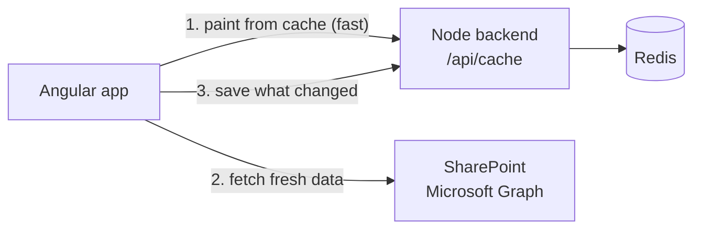
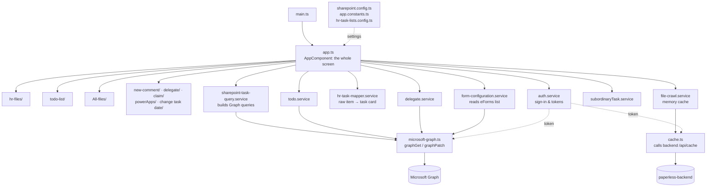
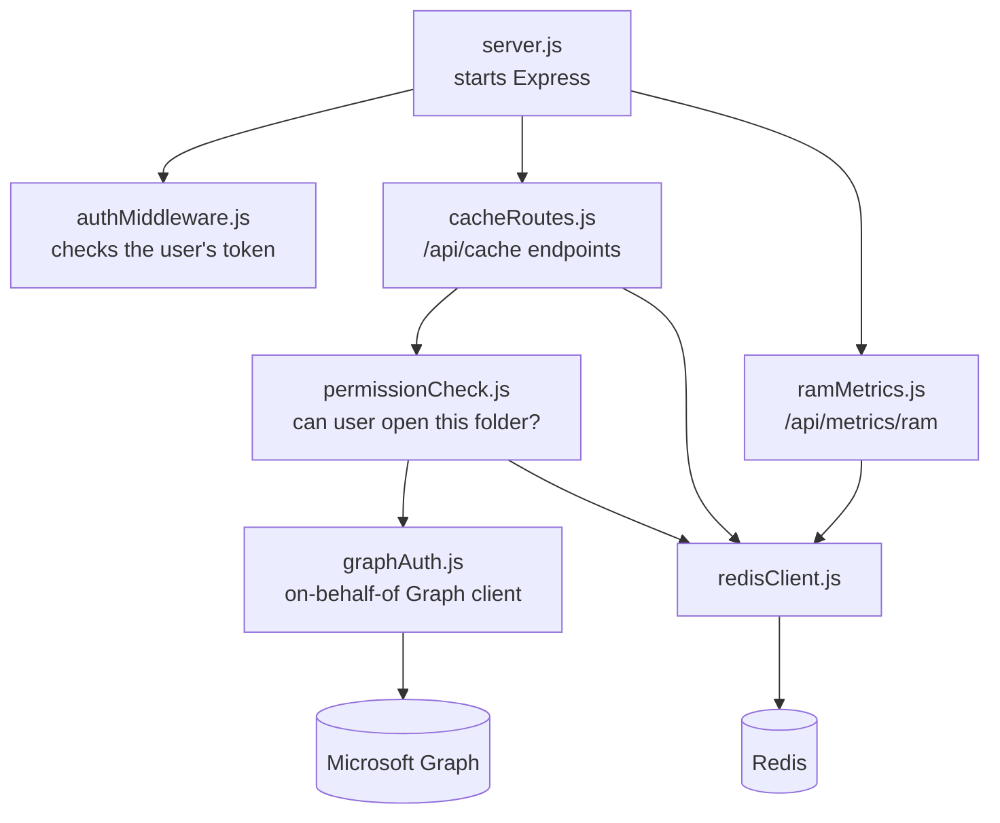
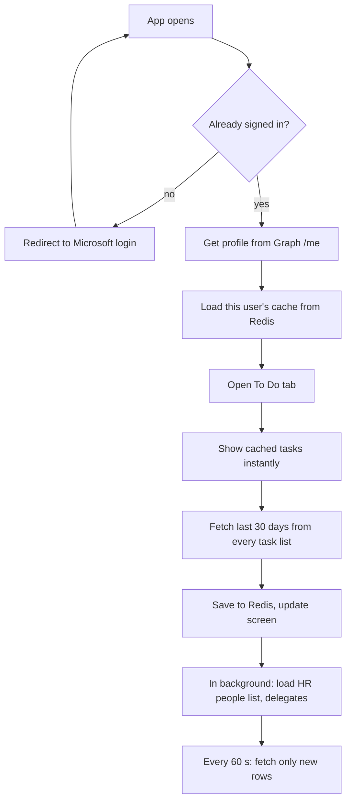
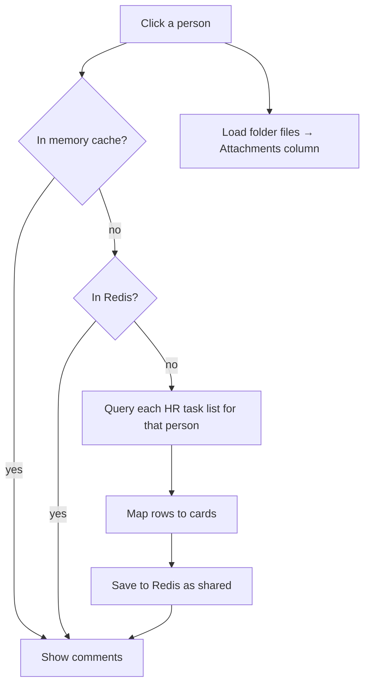

# Paperless

A web app for Enemalta staff to see their **HR tasks**, **eForm comments** and **files** from SharePoint in one place.

- **Frontend:** Angular (`my-app/`)
- **Backend:** Node + Express (`paperless-backend/`)
- **Cache:** Redis
- **Data:** SharePoint Online, read through Microsoft Graph

---

## 1. Quick start

You need three things running. Open three terminals.

```powershell
# 1. Redis (cache)
.\redis-windows\redis-server.exe --port 6379
```

```powershell
# 2. Backend  → http://localhost:3000
cd paperless-backend
npm install
npm run dev
```

```powershell
# 3. Frontend → http://localhost:4200
cd my-app
npm install
npm start
```

Check the backend at http://localhost:3000/api/health. It should return `{ "server": "ok", "redis": "PONG" }`.

### Live and UAT side by side

The same code runs against either SharePoint site. Nothing needs editing to switch; pick the target when you start it. Both can run at once, sharing one Redis.

| | Live (`sites/PaperlessLive`) | UAT (`sites/PaperlessUAT`) |
|---|---|---|
| Backend | `npm run dev` → :3000, reads `.env` | `npm run dev:uat` → :3001, reads `.env.uat` |
| Frontend | `npm run start:live` → :4200 | `npm run start:uat` → :4201 (header says "UAT") |
| Build | `npm run build:live` | `npm run build:uat` |
| Redis | database 0 | database 1 |

The site settings for each target are in `my-app/src/app/sharepoint.config.ts`. `http://localhost:4201` must be a Single-page application redirect URI in Entra.

---

## 2. How it works (big picture)


1. **Sign in.** The user signs in with their Microsoft account through MSAL.
2. **Load data.** Angular calls Microsoft Graph directly to read task lists, eForms and document libraries.
3. **Cache.** Everything Angular loads is saved to Redis through the backend. The next load or the next user then paints instantly.

### The screen

| Column | What it shows | Where |
|---|---|---|
| **Left** | Tabs: *HR Files* (people), *To Do* (my tasks), *All Files* (libraries) | `app.html`, `hr-files/`, `todo-list/`, `All-files/` |
| **Middle** | **Comments**: task cards for the selected person/folder | `app.html` + `app.ts` |
| **Right** | **Attachments**: files in the selected folder | `app.html` + `app.ts` |

On mobile the three columns become tabs (`mobile navigation/`).

---

## 3. Why a Node backend?

Angular could talk to Graph alone. The backend exists for three reasons:

1. **Shared cache.** The browser can't share data between users. Redis can. When one person opens an HR folder, the result is stored once and the next person gets it instantly.
2. **Safety.** The backend checks every user's token and asks Graph *as that user* (the "on-behalf-of" flow) before returning shared data. Nobody can read a cached folder they can't open in SharePoint.
3. **Secrets.** The client secret must never live in the browser. Only the backend holds it (in `.env`).

---

## 4. Redis

Redis is an in-memory key/value store. Here it keeps copies of SharePoint results so the app doesn't download them again on every load, and so one user's load can speed up the next user's.

### How it works



1. **Paint from cache.** On load, the app asks the backend for what Redis already has and shows it straight away.
2. **Fetch fresh data.** The app then loads from SharePoint in the background.
3. **Save what changed.** The new results go back to Redis for the next load.

- **The browser never talks to Redis directly.** Every request goes through the backend, which checks the user's Microsoft sign-in first.
- **There are two caches.** The app also keeps a copy in the browser's memory (`file-crawl.service.ts`) while it's open. Redis is the one that survives a reload and is shared between users.
- **Live and UAT are kept apart:** Live uses database **0** (`redis://localhost:6379`), UAT uses database **1** (`redis://localhost:6379/1`, in `.env.uat`).

### What's stored

| Key in Redis | What it holds | Who can see it |
|---|---|---|
| `cache:<userId>:todo:task:<list>:<id>` | **One To Do task** (see below) | Only that user |
| `cache:<userId>:todo:index` | The list of task keys in that user's To Do | Only that user |
| `cache:<userId>:todo:updated` | When that user's To Do was last saved | Only that user |
| `cache:<userId>:fc:files:lib:…` | All Files library listings | Only that user |
| `cache:<userId>:fc:domain-users:…` | Staff list used for people search | Only that user |
| `shared:fc:files:folder:…` | Folder listings (All Files) | Anyone who can open that folder |
| `shared:fc:tasks:lib:v7:…` | Comments for a library folder | Anyone who can open that list |
| `shared:fc:tasks:hr-folder:…` | Comments for an HR person | Anyone who can open that person's folder |
| `perm:<userId>:…` | "Can this user open X?" (yes 15 min / no 5 min) | Internal |
| `tasks:<list>:<email>` | Old per-person task lookup | Internal |
| `cache:<userId>:fc:tasks:hr-user:v5` | **Old** single To Do snapshot, no longer written; expires on its own | Only that user |

- **Personal keys** (`cache:<userId>:…`): only that user can read or write them. `<userId>` is the user's Microsoft account id.
- **Shared keys** (`shared:…`): checked against the user's SharePoint permissions on every read and write (`permissionCheck.js`).
- **Expiry:** entries expire after **7 days** (`CACHE_ENTRY_TTL_SECONDS`).
- **Logging out** clears all of that user's personal keys, including the To Do tasks.

### To Do: one entry per task

To Do used to be cached as **one big entry per user** (`fc:tasks:hr-user:v5`). It grew to about **27 MB** (10,000+ tasks) and caused two problems:

- **It went out of date.** Every change re-uploaded the whole list. Once it passed the backend's upload limit, saves were rejected (HTTP 413), so Redis kept an old copy. That's why a completed task came back after a reload.
- **It was slow and heavy.** 27 MB went up the wire after every refresh.

Now **each task is stored separately** (about 2–3 KB each), plus a short index of which tasks are in that user's To Do:

| | Before | Now |
|---|---|---|
| Stored as | One 27 MB entry per user | One small entry per task + an index |
| Completing a task | Re-uploads all 27 MB | Removes one entry |
| A reload with nothing changed | Re-uploads all 27 MB | Uploads nothing |
| First load for a user | One 27 MB upload | Chunks of 200 tasks (about 50 requests for 10,000 tasks) |

**How it works in the code**

- **Frontend, `services/todo-task-store.service.ts`:**
  - Holds the To Do tasks in memory.
  - Remembers a fingerprint of each task as last saved.
  - When To Do changes, it uploads **only** the tasks that changed and removes the ones that left, about 1.5 s after the last change.
- **`app.ts`:** uses the store everywhere it used the old entry:

  | Old call | New call |
  |---|---|
  | `fileCrawlCache.getStale(HR_USER_TASKS_CACHE_KEY)` | `todoStore.getAll()` |
  | `fileCrawlCache.get(HR_USER_TASKS_CACHE_KEY)` | `todoStore.getFresh()` |
  | `fileCrawlCache.set(HR_USER_TASKS_CACHE_KEY, …)` | `todoStore.replaceAll(…)` |
  | `fileCrawlCache.invalidate(HR_USER_TASKS_CACHE_KEY)` | `todoStore.invalidate()` |

  `loadTodoTasksForCurrentUser` calls `todoStore.load()` first, so To Do paints from Redis straight away.
- **Backend, `cacheRoutes.js`:**

  | Endpoint | Does |
  |---|---|
  | `GET /api/cache/todo` | Returns this user's To Do tasks and when they were saved |
  | `PUT /api/cache/tasks` | Saves changed tasks and removes old ones: `{ upsert: [{ key, data }], remove: [key] }`, at most 500 per call |
  | `DELETE /api/cache/todo` | Clears this user's To Do cache |
  | `GET /api/cache/delta-test?list=<name>` | **Temporary, read-only:** checks whether a SharePoint list can report "only what changed". Remove it once step 3 below is built. |

- **Why the To Do entries are personal, not shared:** the browser uploads these tasks, so if they were shared, one user could overwrite a task that others see. Shared task entries will only be written by the backend, from its own SharePoint reads (step 3).

**Still to do**

1. **Step 3, backend change sync:** the backend asks each SharePoint list for **only the items that changed** (a Graph *delta query*), at most once a minute per list, shared by all users. This would replace each browser crawling the lists itself, which is what causes 429 "Too Many Requests" errors. It would also catch tasks completed outside the app. `delta-test` checks whether your lists support it.
2. **Step 4:** make the Refresh button use that sync.
3. **Step 5 (optional), webhooks:** SharePoint notifies the backend when a list changes. This only works if the server can be reached from the internet.

Until step 3 is done, a task completed **outside** this app (in Live, or by someone else) can still show in To Do until the next Refresh.

### Looking at the data

- **Redis Insight** (free desktop app): connect to `localhost`, port `6379`, then pick **db0** (Live) or **db1** (UAT).
  - **Browse:** see keys, their size and expiry.
  - **Analyze:** see what uses the most memory.
- **`redis-cli`:** in `redis-windows/`, e.g. `redis-cli -n 1 scard cache:<userId>:todo:index` gives how many To Do tasks a user has cached.
- **Deleting a key is safe** (the app reloads it from SharePoint), but **don't edit the JSON by hand**.

### Limits and security

- **Memory cap:** the local Redis has a **1 GB** cap (`maxmemory 1gb`). When full, it removes the least-used keys (`allkeys-lru`).
- **Upload limit:** the backend accepts request bodies up to **100 MB** (`server.js`). It was 25 MB, which the old To Do snapshot exceeded.
- **If a save is still rejected as too big,** the app deletes the old Redis copy instead of keeping it (`cache.ts`), so it never shows stale data.
- **Locked to this PC:** the local Redis only accepts connections from this PC (`bind 127.0.0.1`, `protected-mode yes`) and has **no password**. That's fine locally. On a server, turn on a password and TLS.
- **Sensitive data:** the cache holds copies of SharePoint data, including HR tasks, in plain JSON. Anyone who can reach Redis can read it.
- **Local version:** the Windows build is Redis **5.0.14**, an unofficial port with no security updates. Use **Azure Cache for Redis** in production; only `REDIS_URL` changes.
- **RAM check:** run `npm run ram-report` in `paperless-backend`, or call `GET /api/metrics/ram`.

---

## 5. The `.env` file

Lives in `paperless-backend/.env`. **Never commit it** (it's already in `.gitignore`).

| Key | What it is | Example |
|---|---|---|
| `TENANT_ID` | Enemalta's Microsoft tenant id | from `sharepoint.config.ts` |
| `CLIENT_ID` | The Azure app registration id | from `sharepoint.config.ts` |
| `CLIENT_SECRET` | Secret for that app (Azure → *Certificates & secrets*) | `abc~123…` |
| `REDIS_URL` | Where Redis is running | `redis://localhost:6379` |
| `SITE_PATH` | SharePoint site in Graph form | `emoffice365.sharepoint.com:/sites/PaperlessLive` |
| `TASKS_LIST` | Default list for `/api/tasks` | `HRTaskTelework` |
| `CACHE_TTL_SECONDS` | Expiry for `/api/tasks` cache | `300` |
| `PORT` | Backend port | `3000` |
| `CORS_ORIGINS` | Sites allowed to call the backend (comma-separated) | `http://localhost:4200` |
| `CACHE_ENTRY_TTL_SECONDS` | *(optional)* Cache expiry, default 7 days | `604800` |
| `HR_LIBRARY_NAME` | *(optional)* HR library name, default `HRPersonal` | `HRPersonal` |

**One-time Azure setup** (app registration → *Expose an API*): add the scope `access_as_user`. Angular asks for this scope to call the backend.

---

## 6. Folders

```
Paperless/
├── my-app/                 Angular frontend
│   ├── src/app/            All app code (see below)
│   ├── public/             Icons and images
│   ├── desktop/            Electron wrapper → Windows .exe
│   └── scripts/            Old HTML extracts (reference only)
├── paperless-backend/      Node + Express API, talks to Redis
├── redis-windows/          Portable Redis for local dev (not in git)
├── reusable login template/  Stand-alone MSAL sign-in template
├── .github/workflows/      Auto-deploy frontend to GitHub Pages on push to main
└── cleanup-component-naming.ps1   One-off script to tidy component folder names
```

---

## 7. How the files connect

### Frontend



### Backend



---

## 8. Where to find things

### Frontend: `my-app/src/app/`

**Root files**

| File | What it does |
|---|---|
| `app.ts` / `app.html` | The main screen. Holds all three columns and most of the logic. |
| `sharepoint.config.ts` | **Start here.** Tenant, site, backend URL, list names. |
| `app.constants.ts` | Tuning numbers: page sizes, timeouts, how many days of tasks to load. |
| `hr-task-lists.config.ts` | Names of the HR/procurement task lists to read. |
| `microsoft-graph.ts` | `graphGet`, `graphPost`, `graphPatch`, `graphGetWithRetry`: every Graph call goes through here. |
| `utils.ts` | Retry, delay, `Semaphore`, `runWithConcurrencyLimit`. |
| `file-utils.ts` | File icons, extensions, SharePoint URL fixes. |
| `form-utils.ts` | `formatFormTitle`: turns `SickLeave_Tasks` into "Sick Leave". |

**Key functions in `app.ts`**

| Area | Functions |
|---|---|
| Sign-in | `checkLoginOnStart`, `trySilentSignIn`, `loadCurrentUserProfile`, `logout` |
| To Do | `loadTodoTasksForCurrentUser`, `refreshTodoTasksIncrementally`, `loadMoreTodoTasks`, `reloadTodoTasksWithSubordinates` |
| HR Files | `loadHrFilesInFirstSection`, `openHrFileListItem`, `prefetchHrPersonComments`, `warmHrPersonalRootFoldersCache` |
| All Files | `onLibrarySelected`, `onAllFileSelected`, `loadAllFilesTasksForLibrary` |
| Attachments | `openFolder`, `goBackToParent`, `loadMyFilesFromDrive` |
| Refresh | `onManualRefresh` (button), `startSharePointCachePoll` (auto every 60 s) |
| Actions | `onDelegateTask`, `onCompleteTask`, `onNewCommentSaved`, `onTaskDueDateChanged` |

**Components: `components/`**

| Folder | What it is |
|---|---|
| `hr-files/` | People list in HR Files (search, sort, paging). |
| `todo-list/` | My Tasks list, plus the *Subordinate Tasks* manager view. |
| `todo-list/change task date/` | Date picker that saves a new due date to SharePoint. |
| `All-files/` | Library browser and search across files, comments and attachments. |
| `new-comment/` | "Add comment" popup. `complete/` is the Complete-task popup. |
| `delegate-component/` | Reassign a task to another user. |
| `Claimable Task/` | Claim a task from a shared queue. |
| `powerApps/` | The "+" popup that opens eForms in PowerApps. |
| `app-dropdown/` | Reusable dropdown used across the app. |
| `manual-refresh/` | The refresh button. |
| `loading screen/` | Spinner. |
| `mobile navigation/` | Bottom tab bar on phones. |

**Services: `services/`**

| File | What it does | Main functions |
|---|---|---|
| `auth.service.ts` | Microsoft sign-in and tokens | `initialize`, `acquireGraphToken`, `acquireSharePointToken`, `loginRedirect`, `logoutRedirect` |
| `cache.ts` | Talks to backend `/api/cache` | `get`, `set`, `clear`, `entriesByPrefix`, `deleteByPrefix` |
| `file-crawl.service.ts` | Fast in-memory cache, synced with Redis | `bindToUser`, `get`, `getStale`, `set`, `invalidate`, `clearAll` |
| `todo-task-store.service.ts` | To Do cache: one Redis entry per task, uploads only what changed (see section 4) | `load`, `getAll`, `getFresh`, `replaceAll`, `invalidate` |
| `sharepoint-task-query.service.ts` | Builds and runs task queries for each list | `resolveSharePointUserLookupId`, `resolveHrFolderPersonEmail` |
| `hr-task-mapper.service.ts` | Turns a raw SharePoint row into a task card | `mapSharePointItemToHrTask`, `resolveTaskSubmitter` |
| `hr-task-folder-match.service.ts` | Does this task belong to this person's folder? | `doesSharePointTaskMatchFolder` |
| `form-configuration.service.ts` | Reads the **eForms** list (which forms exist and where) | `load`, `getFormByTitle`, `getHrTaskListNames` |
| `todo.service.ts` | Holds the To Do list, saves due dates | `setTasksFromSharePoint`, `updateTaskDueDate` |
| `delegate.service.ts` | Who can delegate, and writes the new assignee | `loadDelegates`, `searchUsers`, `updateAssignedTo` |
| `subordinaryTask.service.ts` | Finds a manager's staff from **AllDomainUsers** | `ensureSubordinatesForManager`, `findUserForHrFolder` |
| `comment.service.ts` | Saves comments and attachments to SharePoint | `createCommentTask` |
| `domain-user.service.ts` | Loads the AllDomainUsers list once | `getUsers` |
| `site-metadata.service.ts` | Caches site id + list of lists | `resolve`, `findList` |
| `sharepoint-list.service.ts` | Simple list helpers | `getAllLists`, `getListByName`, `getListItems` |
| `user.service.ts` | Current user and name matching | `getCurrentUser`, `matchesAssigneeField` |
| `backend-api.service.ts` | Calls backend `/api/tasks` | `invalidateTasksForPerson` |
| `task.service.ts` / `document.service.ts` | Lists all task lists / document libraries | `loadTaskLists`, `getLibraries` |

**Helpers: `utils/`**

| File | What it does |
|---|---|
| `comment-utils.ts` | Read and build comment HTML, approval filters. |
| `comment-card-builders.ts` | Build the card shown after saving a comment. |
| `hr-task-matching.ts` | Match tasks by person lookup id, eForm id, task chain. |
| `person-name-matching.ts` | Match people by name/email even when spelled differently. |

### Backend: `paperless-backend/`

| File | What it does |
|---|---|
| `server.js` | Starts Express, sets CORS, registers all routes. |
| `authMiddleware.js` | `requireUser`: rejects requests without a valid Microsoft token. |
| `graphAuth.js` | `getGraphClient`: swaps the user's token for a Graph token (on-behalf-of). |
| `cacheRoutes.js` | The `/api/cache` endpoints. Decides personal vs shared keys. Also the per-task To Do cache: `/todo`, `/tasks`, and the temporary `/delta-test` (see section 4). |
| `permissionCheck.js` | `filterAllowedKeys`, `canAccessKey`: asks Graph if the user can open a folder/list. `getSiteId`: the site id, shared with `cacheRoutes.js`. |
| `redisClient.js` | Single shared Redis connection. |
| `ramMetrics.js` | `collectRamMetrics`: Redis memory report. |
| `scripts/redis-ram-report.js` | Same report from the command line. |

**Endpoints**

| Method | Path | Auth | Purpose |
|---|---|---|---|
| GET | `/api/health` | no | Server + Redis up? |
| GET / PUT / DELETE | `/api/cache/entry` | yes | One cache entry |
| GET / DELETE | `/api/cache/entries?prefix=` | yes | Many entries by prefix |
| GET / DELETE | `/api/tasks/:email?list=` | yes | Cached per-person task lookup |
| GET | `/api/metrics/ram` | yes | Redis memory report |

---

## 9. Main flows

### Sign-in → first screen



### Opening an HR person / folder



---

## 10. SharePoint lists used

| List | Used for |
|---|---|
| `eForms` | Master list of forms: task list, library, order |
| `HRTask*` (e.g. `HRTaskTelework`, `HRTaskMissingPunch`) | HR tasks |
| `SickCertificateUploader_Tasks`, `PerformanceReview_Tasks` | Extra HR tasks |
| `ProcTasks`, `ProcTasks1`, `ECTasks` | Procurement tasks (To Do only) |
| `HRPersonal` (library) | One folder per employee |
| `AllDomainUsers` | Employees, emails, managers |
| `UsersWhoCanDelegate` | Who may reassign tasks |
| *User Information List* (hidden) | Maps a user to the number SharePoint stores in "Assigned To" |

---

## 11. Deploying to UAT

1. Run Redis and the backend on the server (`npm start`, port 3000).
2. Point IIS or nginx so `/api/*` goes to `http://127.0.0.1:3000`.
3. In `sharepoint.config.ts`, switch to the UAT lines: `redirectUri` = the UAT URL, `backendUrl` = `''`.
4. `ng build`, then copy `dist/my-app/browser` to the IIS site.
5. Add the UAT URL as a redirect URI in the Azure app registration.
6. Test: `https://<uat>/api/health` should show `redis: PONG`.

**Desktop app:** run `my-app/desktop/build-desktop.bat`. The installer appears in `my-app/desktop/release/`.

---

## 12. Saving your work to GitHub

Run these from the `Paperless` folder.

```powershell
# See what changed
git status

# Stage everything (files in .gitignore, like .env, are skipped)
git add -A

# Save a snapshot with a message
git commit -m "Describe what you changed"

# Upload to GitHub on your current branch
git push
```

The first time you push a new branch, use `git push -u origin <branch-name>`.

**Working on a branch** (recommended, so `main` stays safe):

```powershell
git checkout main
git pull
git checkout -b my-change
# ...make changes, then add / commit / push as above...
```

Then open a Pull Request on GitHub to merge it into `main`.

> Pushing to `main` automatically deploys the frontend to GitHub Pages (`.github/workflows/deploy-pages.yml`).

---

## 13. Good to know

- **`app.ts` is big (~7,400 lines).** Use the section headers (`// ====`) and the function names above to find your way.
- **Person columns store numbers, not names.** "Assigned To" holds a *lookup id*. `delegate.service.ts → updateAssignedTo` explains how it's resolved and written.
- **Cache key version.** If you change the shape of cached data, bump the version in the key (e.g. `lib:v7` → `lib:v8`) so old data is ignored.
- **Unused files** you can delete: `services/hr-task.service.ts` and `components/comments/comments-panel.component.ts` (both empty), `comments-panel.component.html`, `attachments-panel.component.html`.
